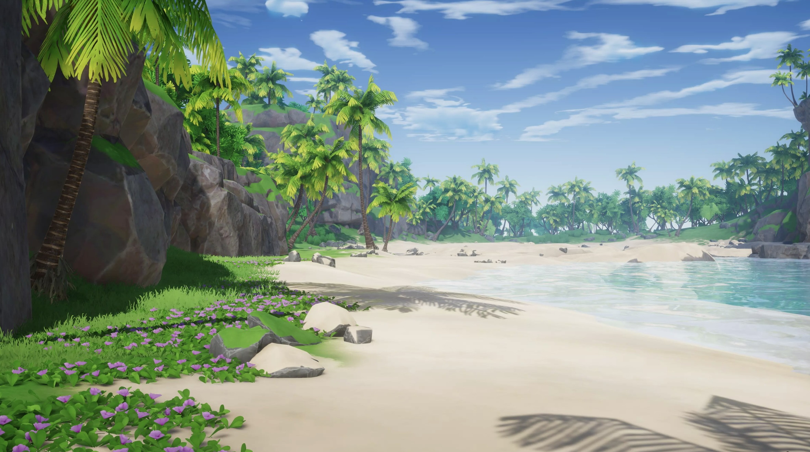
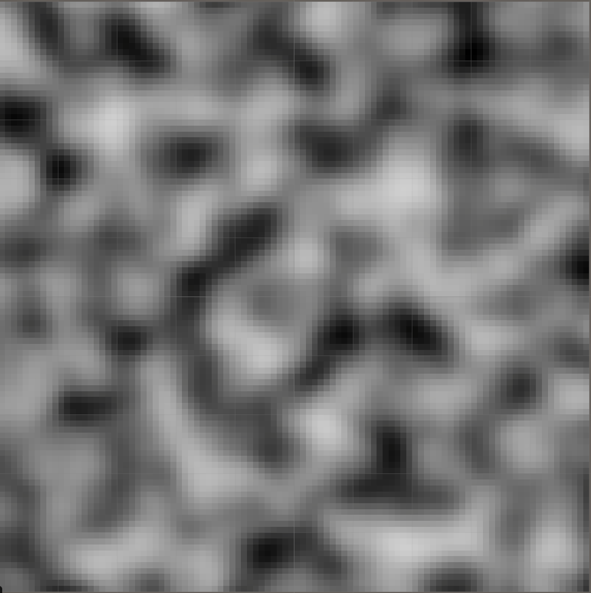
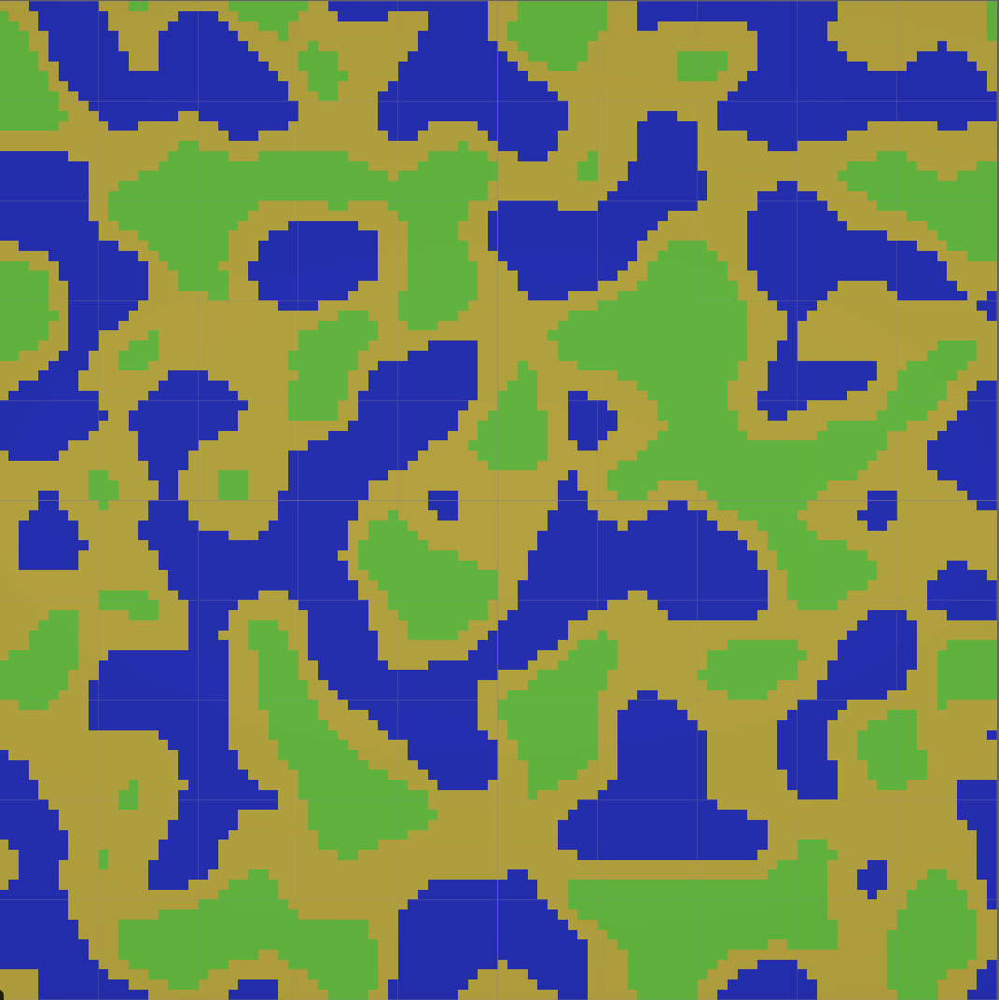
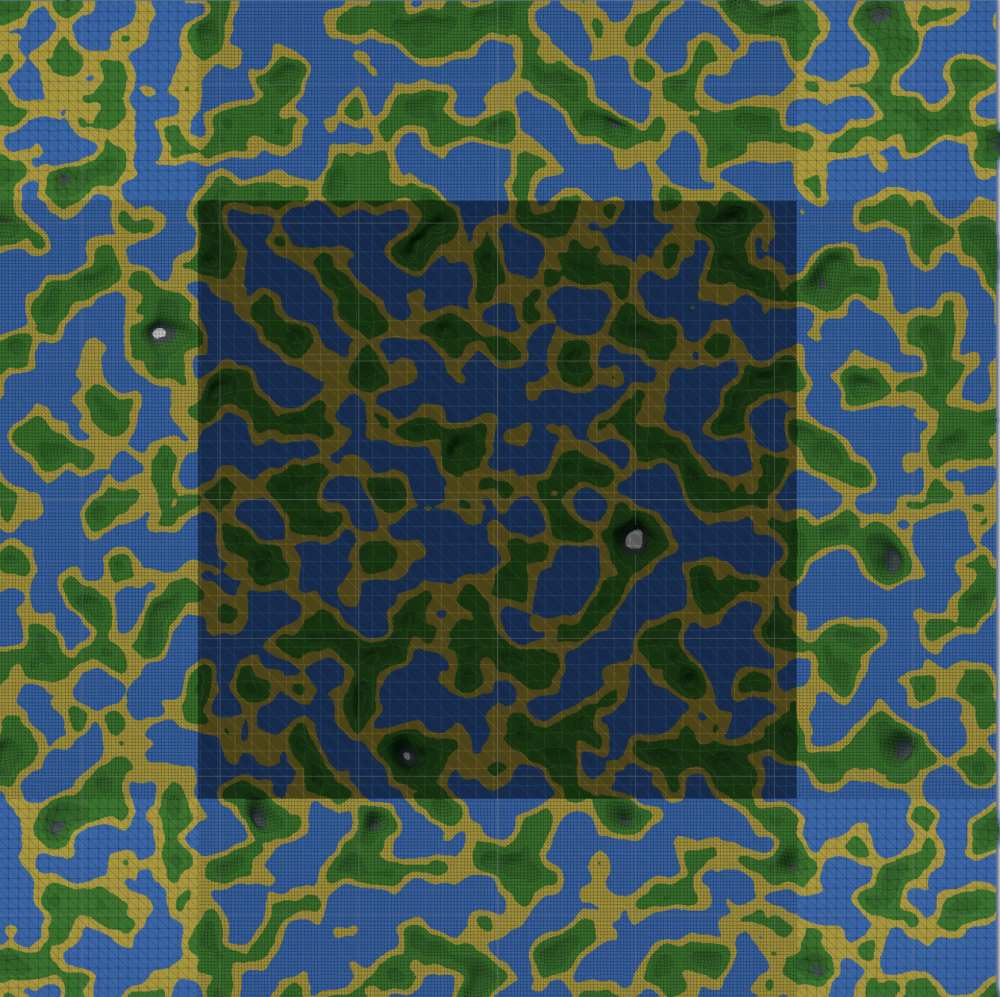
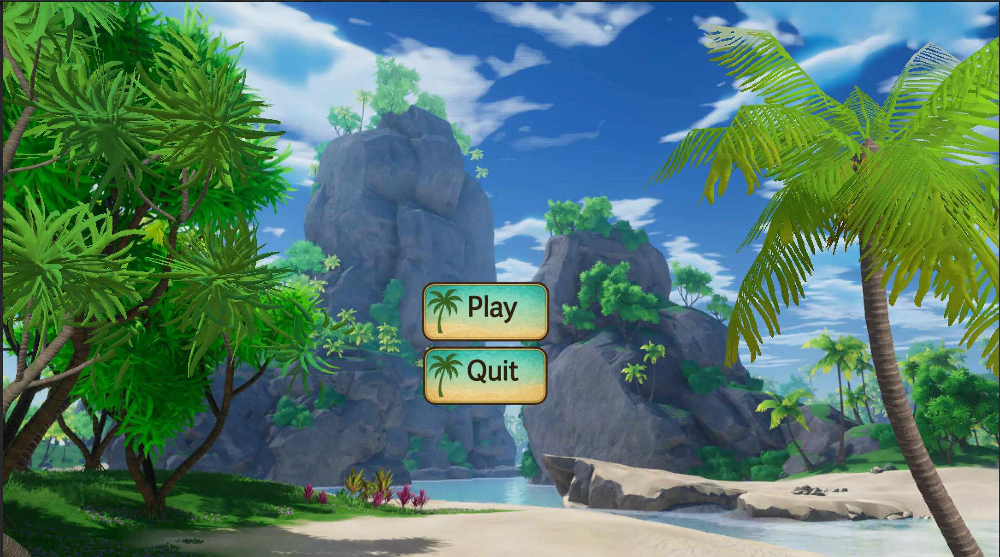
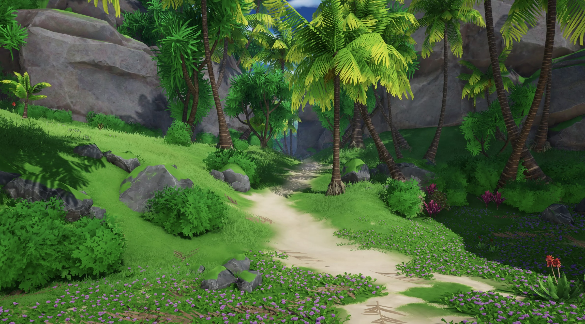

# PCG Math Runner

**A procedurally generated exergame designed to help elementary school children practice basic math operations.**  
Navigate through ever-changing island worlds using the Wii Balance Board or keyboard input, and solve math tasks that adapt to your skill level.

---

---

## 🎮 Gameplay

- Control a character running through a dynamically generated island.
- Each level is **procedurally generated** – no two runs are the same.
- During the run, **math problems** (addition, subtraction, multiplication, division) appear.
- Solve them correctly to earn points and keep the game easy.
- Wrong answers? → The game gets **harder**: more obstacles, narrower paths, faster pacing.

---

## 🧠 Learning Goals

- Promote **basic math skills** through motivating gameplay.
- **Adaptive difficulty**: math tasks scale with the player's performance.
- Encourage **physical activity** with support for the Wii Balance Board (optional).

---

## 🧰 Technical Overview

| Component             | Description                                                                    |
| --------------------- | ------------------------------------------------------------------------------ |
| 🎮 Input              | Wii Balance Board (via Bluetooth) or fallback to keyboard                      |
| 🧱 Terrain Generation | Spline-based paths, procedural islands using noise-based terrain               |
| 🧩 Task System        | Procedural math task generation with adaptive difficulty                       |
| 🧠 Player Model       | Skill tracking to dynamically adapt challenges and environments                |
| 🚧 Obstacle Logic     | Incorrect answers trigger runtime difficulty increase via additional obstacles |

---

## 🚀 Features

- **Procedural Island Generation**

  - Heightmap generated with Perlin noise
  - Color‐mapped terrain with ocean, beach, grass, rock zones
  - Infinite world split into chunks with LOD around the player

- **Adaptive Math Engine**

  - Player profile tracks performance
  - Learn Engine delivers new math problems every round
  - Meta-progression tailors difficulty to you

- **Seamless Gameplay**
  - Real-time chunk loading/unloading around the player
  - Smooth transitions between terrain LODs

---

## 📸 Screenshots

|    **Raw Perlin‐Noise Heightmap**     |         **Color‐Mapped Terrain**         |
| :-----------------------------------: | :--------------------------------------: |
|  |  |

3. **Chunked LOD Around Player in Shaded Wireframe Mode**  
   

4. **User Interface**  
   

5. **Playable Environment Showcase**  
     
   
